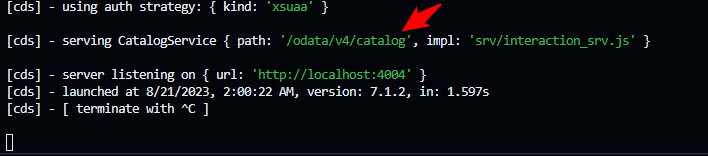

# CAP Service
# CURSO Create Calculation View and Expose via CAP (SAP HANA Cloud) (Thomas Jung)

Steps
- https://developers.sap.com/tutorials/hana-cloud-deploying.html
- https://developers.sap.com/tutorials/hana-cloud-cap-create-project.html
- https://developers.sap.com/tutorials/hana-cloud-cap-create-database-cds.html
- https://developers.sap.com/tutorials/hana-cloud-cap-calc-view.html
- https://developers.sap.com/tutorials/hana-cloud-cap-stored-proc.html
- https://developers.sap.com/tutorials/hana-cloud-cap-add-authentication.html

OUTROS CURSOS
- https://developers.sap.com/tutorials/hana-cloud-cap-create-ui.html
- https://developers.sap.com/tutorials/hana-cloud-cap-add-authentication.html

# TIP: At the end of above course: It only works if write this command 
**cds watch --profile hybrid**
cds watch --profile hybrid

# TIP2: 
Try adding this to end of test URL:
/catalog/V_Interaction

# IF ERROR:
  Try this path:
  /odata/v4/catalog/V_Interaction
  /odata/v4/catalog/sleep()

TIP for catalog path:
Try to see in CDS RUN, what the catalog path.

# TIP Add App Router
  cds add approuter

https://developers.sap.com/tutorials/hana-cloud-cap-stored-proc.html
  YOUTUBE Video of this lesson:
  https://www.youtube.com/watch?v=wr9KpbqsNpM
Pre-requisites
    Create App to List Records
        https://developers.sap.com/tutorials/hana-cloud-cap-create-ui.html
          YOUTUBE lesson:
          https://www.youtube.com/watch?v=WMDpKa1QkFE&embeds_referring_euri=https%3A%2F%2Fdevelopers.sap.com%2F&feature=emb_imp_woyt
            **Here we learn to create route to expose our CAP Service.
            New command:
            cds add approuter**
    Authentication
        https://developers.sap.com/tutorials/hana-cloud-cap-add-authentication.html
          YOUTUBE lesson
          https://www.youtube.com/watch?v=AvROFBCEcEc
